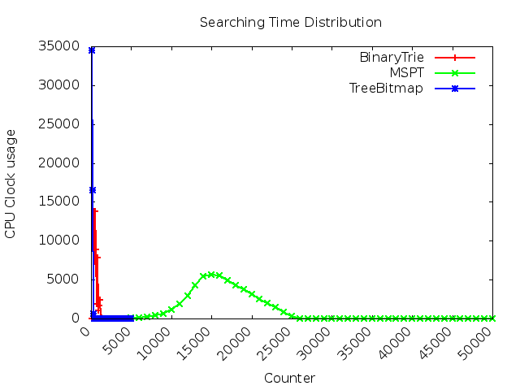
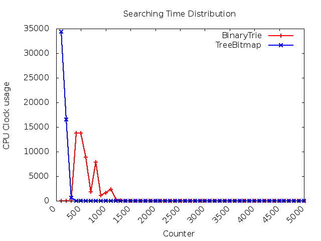

# Performance of different trie

## Searching Time 
Searching time performance among three data structure: 
* Binary trie
* Most Specific Prefix trie (e.g `MSPT`)
* Tree bitmap

(With MSPT)

(Without MSPT)

## Memory usage/ Memory Access times

| Model | Size per node (`byte`) | Number of nodes | Total Memory Consumption (`KB`) | Total memory access times |
| ------ | ------ | ------ | ------ | ------ |
| Binary Trie | 24 | 668383 | 15665.226562 | 242494700 | 
| Treebitmap | 24 | 49108 | 283.231445 | 10717400 | 
| MSPT | 32 | 47712 | 1491.000000 | 71089400 | 

